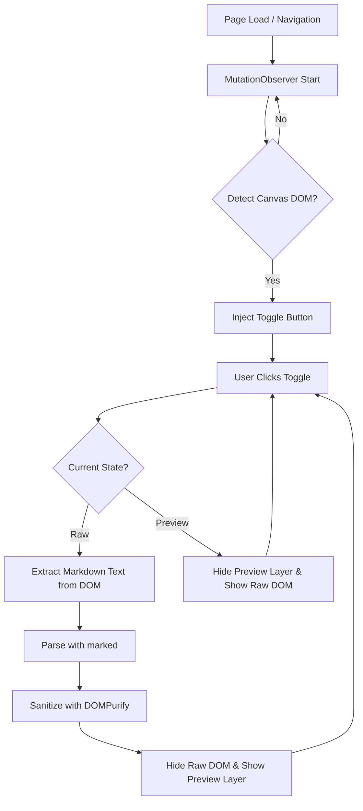

# Project Overview

**プロジェクト名:** Gemini Canvas Markdown Toggle

**目的:** Gemini (gemini.google.com) のUI上で表示される「Canvas（エディタライクな領域）」において、MarkdownテキストのRaw（生テキスト）表示と、Preview（レンダリングされたHTML）表示をシームレスに切り替えるChrome拡張機能を開発する。

**スコープ:**

* 対象URL: https://gemini.google.com/*
* Read-Onlyのプレビュー機能の提供（プレビュー画面での直接編集は不要）。
* SPA（Single Page Application）特有の動的なDOM変化に対する追従。

# Tech Stack

| カテゴリ | 技術・ライブラリ | バージョン/備考 |
| :--- | :--- | :--- |
| **プラットフォーム** | Chrome Extension | Manifest V3 (MV3) |
| **言語** | Vanilla JavaScript (ES6+), CSS | ビルドツール不要の構成 |
| **Markdownパーサー** | marked | 軽量・高速なパース |
| **サニタイザー** | DOMPurify | XSS攻撃を防ぐためのHTMLサニタイズ（必須） |
| **スタイリング** | github-markdown-css | プレビュー領域に標準的なMarkdownスタイルを適用 |

*※ライブラリはCDNからの読み込み（MV3ではCSP制限があるため）、または拡張機能パッケージ内にローカルファイルとして同梱（推奨）します。*

# Architecture

## Directory Structure

```text
gemini-canvas-toggle/
├── manifest.json
├── icons/
│   ├── icon16.png
│   ├── icon48.png
│   └── icon128.png
├── libs/
│   ├── marked.min.js
│   ├── purify.min.js
│   └── github-markdown.css
├── src/
│   ├── content.js      # メインロジック（DOM監視、ボタン注入、トグル処理）
│   └── content.css     # トグルボタンやプレビューコンテナの独自スタイル
```

## Data Flow



# Features & Requirements

## Priority: Must Have

1.  **SPA Monitoring (動的監視)**
    * MutationObserver を使用して body 全体を監視し、GeminiのCanvas領域（エディタコンテナ）が出現したことを検知する。
    * 汎用的なセレクタ（例: 特定の属性、タグ構造、またはCanvasに特有の特徴を持つコンテナ）を用いて対象DOMを特定する。
2.  **UI Injection (ボタン追加)**
    * 対象となるCanvasコンテナの右上（または視認性の高い位置）に、「Raw / Preview」を切り替えるトグルボタンを挿入する。
    * 重複挿入を防ぐロジック（特定のクラスやIDの存在チェック）を実装する。
3.  **Markdown Extraction (テキスト抽出)**
    * Canvas内のエディタ要素（textarea または contenteditable な要素など）から、現在のMarkdown文字列を抽出する。
4.  **Rendering & Sanitization (変換と安全化)**
    * 取得したMarkdownを marked.parse() でHTML文字列に変換する。
    * 変換されたHTML文字列を DOMPurify.sanitize() で無害化する。
5.  **View Toggling (表示切り替え)**
    * プレビューモード時：元のエディタ要素（Raw表示）を display: none や opacity: 0 等で隠蔽し、同じ領域にオーバーレイする形でプレビュー用 div を表示する。プレビュー用 div には markdown-body クラスを付与し、github-markdown.css を適用する。
    * Rawモード時：プレビュー用 div を非表示にし、元のエディタ要素を表示状態に戻す。

## Priority: Should Have

* **Responsive / Resizing:** ウィンドウサイズが変更された際や、Canvas領域のサイズが動的に変わった際に、プレビューコンテナのサイズが適切に追従すること。
* **Theme Support:** Gemini本体のダークモード・ライトモードの切り替えに追従するか、または見栄えの良いデフォルトスタイルを提供すること。

## Priority: Nice to Have

* **Copy Button:** プレビュー画面上に、レンダリングされたHTMLではなく、元のMarkdownテキストをクリップボードにコピーするボタンを設置。

# Data Structure / State Management

content.js 内で保持するシンプルな状態モデルです。

```javascript
// 状態管理のイメージ（Vanilla JSで実装）
const state = {
  mode: 'RAW', // 'RAW' | 'PREVIEW'
  canvasElement: null, // 発見したCanvasの親コンテナDOM
  rawEditorElement: null, // Markdownテキストを保持しているDOM
  previewContainerElement: null, // 生成したプレビュー用DOM
  toggleButtonElement: null, // 生成したボタンDOM
  currentMarkdownText: "" // 最後に抽出したテキストキャッシュ
};
```

# DOM & Logic Definition

### 1. 汎用的なDOM特定戦略

Geminiのクラス名は難読化されているため、以下のような汎用的なヒューリスティックでCanvasを特定します。

* **特定方法案:** `<textarea>` や contenteditable="true" を持ち、かつスクロール可能な大きな領域を持つコンテナを探す。または、Canvas領域に特有のARIA属性（例: role="textbox" や aria-label="ドキュメント" に類するもの）をキーにする。
* AIへの指示: 「クラス名に依存せず、要素の属性や階層構造の特徴からエディタ領域を特定するロジックを実装してください」

### 2. トグルボタンの処理定義

* **Input:** click イベント
* **Process:**
    1.  現在のモードをトグル。
    2.  mode === 'PREVIEW' の場合：
        * rawEditorElement からテキスト取得。
        * 変換・サニタイズ。
        * previewContainerElement.innerHTML に流し込み。
        * rawEditorElement を非表示、previewContainerElement を表示。
    3.  mode === 'RAW' の場合：
        * previewContainerElement を非表示、rawEditorElement を表示。

# LLM Guidelines (コーディングAIへのプロンプト例)

この仕様書をCursorなどのAIエディタに読み込ませる際は、以下のプロンプトを併用すると効果的です。

> @gemini-canvas-toggle-specs.md の仕様書に基づき、Chrome拡張機能の実装を開始してください。
>
> まずは manifest.json を V3 で作成し、content.js と content.css のスケルトンを作ってください。
>
> 外部ライブラリ (marked, DOMPurify, github-markdown-css) はCDNから取得するのではなく、拡張機能内でローカルファイルとして読み込む構成にしてください。
>
> 難読化されたクラス名に依存せず、MutationObserver を用いて堅牢にDOMを監視・特定するロジックの実装に注力してください。
